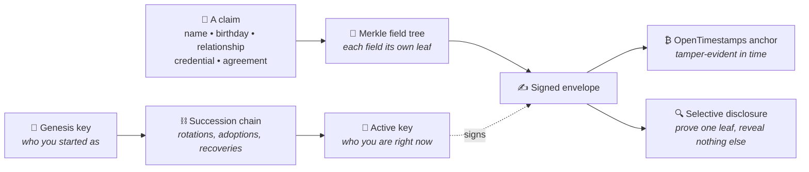
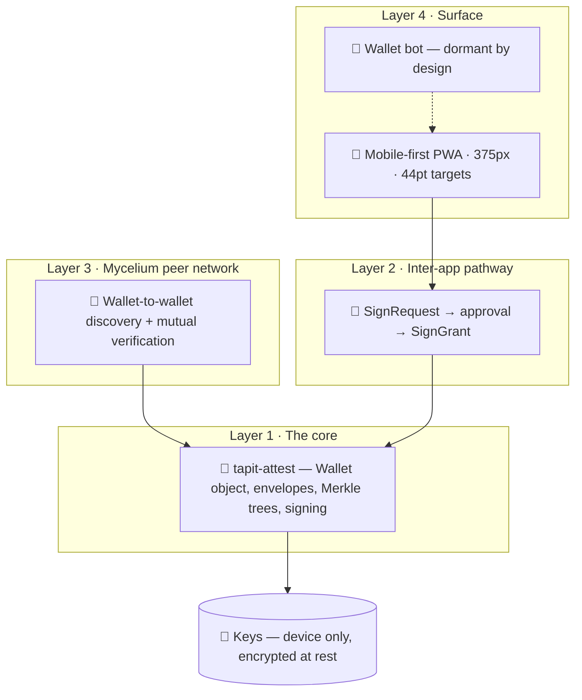

<div align="center">

# 🔑 Tapit Wallet

### Your identity is not a row in someone else's database.

**A sovereign identity wallet.** It generates and holds your keypair, and it is the
Merkle holder of the signed attestations that make up your verifiable life —
identity, relationships, credentials, agreements.

It is the one place your private keys ever live, and the hub every other app
connects **to** in order to get something signed.

<br>


</div>

---

## The inversion

Today your professional standing is rented from LinkedIn. Your customer history is
scattered across CRMs you cannot read. Your community standing sits on a platform
that can suspend you tomorrow. **You do not own any of it.**

Tapit makes identity a thing you *hold*.

| | **Rented identity** | **Held identity** |
|---|---|---|
| **Where it lives** | A company's database | A keypair on your device |
| **Who can revoke it** | Them, silently, at any time | No one |
| **Who can read it** | Them, their partners, their acquirer | Only who you show |
| **What proves it** | Their word | Math |
| **If you lose the device** | Beg support | Rebuild from the people who signed you |
| **If the company dies** | So does your history | Nothing happens |

**The core promise:** one identity per person, owned by them, that every app can
request signatures from and every other wallet can verify — *without anyone
trusting a platform.* Including us.

---

## 🌉 The mission — we are the bridge, and the bridge teaches

Everything Tapit does **already exists** in the world. Shamir secret sharing.
Schnorr signatures. OpenTimestamps anchoring. Web-of-trust. Threshold schemes.
We invented none of it.

> **Our job is to package these existing tools so an ordinary person can do
> something they never could have done before — hold their own keys, split a
> secret among the people they trust, prove a moment happened and can't be
> tampered with, recover what they'd otherwise lose forever — _without having to
> understand the cryptography first._**

But the product is the bridge **and the education**. A person should be able to
tap it and, through the act of using it, learn what they're doing and why it is
good for their own sovereignty. That discovery process — **sovereignty literacy
delivered through use**, in plain, non-biased language, assembled for the
individual's benefit above any group's, any company's, or our own — *is* the app.

We are not mesmerizing users or farming their attention. We hand them a tool and
teach them to be free with it, the way the calculator handed people math they
could never have done by hand.

Every cut has two jobs: make the capability **reachable**, and leave the person a
little more **able to have chosen it themselves**. A cut that does the first
without the second is half done.

> Built for the operator and his family first: **if it only ever works for one
> family, it already succeeded.** Offered as a gift to anyone who hits the same walls.

---

## 🧬 One primitive, everything else is composition

This is the load-bearing idea. Identity is the genesis key; the *active* key is
whatever the verifiable succession chain resolves to; and every claim is a signed
envelope on a Merkle field tree, optionally anchored to Bitcoin.



That single abstraction is why key rotation, identity adoption, disclosure proofs,
social recovery, org governance and peer-mediated key release all **fall out as
composition rather than new mechanism.**

Prove you're over 21 without showing your birthday. Prove a relationship without
exposing your contacts. Rotate your key without becoming a stranger.

---

## ✅ What it does today

Not a roadmap. These are shipped, tested, and working end-to-end.

**🔐 Identity & keys**
- Passphrase key generation behind a double-warn gate — BIP340, Nostr-compatible by construction
- Identity attestation with **OpenTimestamps Bitcoin anchoring**, pending → confirmed with block height
- **Import an existing nsec** at onboarding, *or* adopt one into a wallet you've already built —
  both non-destructive via the succession chain. Bring your Nostr identity in from either direction.

**👥 People & trust**
- Peer relationship attestations — in-person (3-QR handshake) and remote (over Nostr), typed by relationship
- **NIP-17 gift-wrapped encrypted chat**, rotation-safe on both send and receive
- Family units with member ratification, rendered as a Tree ring; organizations with a six-kind join-policy substrate

**🛡️ Recovery & custody**
- **Shamir-split social recovery** — designate a cohort, distribute shares, run the ceremony
- Layered backup: the device, an encrypted export you keep, an encrypted cloud mirror, and peer rebuild.
  **No single holder — ours included — can read it or is a sole point of failure.**
- Peer-mediated key-release substrate: identity-leaf credentials, release-authority envelopes, gated-release verification

**🔍 Proof & disclosure**
- Multi-leaf and single-leaf selective disclosure proofs
- The verifier path runs **outside the auth gate** — a wallet-less stranger can verify at `/verify`
  without downloading anything, without an account, without trusting us

**🔗 Connection & expression**
- Layer 2 inter-app signing: an app sends a `SignRequest` → you see a plain-English approval screen → it gets a `SignGrant`
- Sign-in requests over Nostr, answered live with no page reload
- Nostr kind-0 profile publishing and kind-1 "Share to Nostr" on journal entries
- A journal/diary primitive with categories, attachments and anchoring

---

## 🏛️ Architecture — four layers, built bottom-up



`tapit-attest` is inherited from the chassis and consumed as a `file:` dependency.
**It is never re-implemented — one library, one envelope standard, fleet-wide.**

### The zero-knowledge line

```
   Your device  ─────────► encrypt client-side ─────────►  Supabase
   plaintext keys              PBKDF2 + passphrase           ciphertext only
   in memory only                                            forever
```

| The host can see | The host can **never** see |
|---|---|
| That a blob exists | Your private key |
| Who owns the row (RLS-scoped) | Any attestation's contents |
| When it was updated | Your relationship graph |

A backend that could read your attestation graph would betray the entire premise.
**The user's keys never leave the wallet unencrypted — that rule outranks every
other rule in this repo.**

---

## 🚀 Quickstart

```bash
npm install
npm run dev          # http://localhost:5173
```

Verify everything the way CI does:

```bash
npm run verify       # typecheck → lint → test → build → baseline → doctrine
```

> **Note:** `tapit-attest` and `bip341-psbt-signer` are local `file:` dependencies.
> `npm run build` builds them via `prebuild`; if you run `npm test` on a fresh
> clone first, build them once with
> `npm --prefix tapit-attest run build && npm --prefix bip341-psbt-signer run build`.

**Environment** — names only, values never in the repo:
`ANTHROPIC_API_KEY`, `SUPABASE_URL`, `SUPABASE_ANON_KEY`.
**Never** a user's private key or seed. Those are not env vars, are never logged,
and are never committed.

---

## 🗺️ Repo map

```
src/features/<slug>/     32 feature modules — each with a manifest.ts and an index.ts edge
  wallet-core/           the keypair, succession chain, Merkle holder
  identity-gate/         peer-mediated key release, release-authority envelopes
  recovery/              Shamir social recovery
  disclosure/            selective-leaf proofs + the public verifier
  messaging/             NIP-17 gift-wrapped chat
  anchoring/             OpenTimestamps → Bitcoin
  family-tree/  governance/  journal/  sign-request/  ...
tapit-attest/            the inherited core library — never re-implemented
bip341-psbt-signer/      Taproot PSBT cosigning
supabase/                migrations + edge functions
```

A feature is something you can **pause, price, or remove cleanly** — its
`manifest.ts` says so, and a test fails if it's missing.

---

## 📊 Status

| Layer | State |
|---|---|
| **1 — Identity core** | Majority shipped |
| **2 — Inter-app signing** | Shipped (deeplink + Nostr; NIP-46 transport swap deferred) |
| **3 — Peer network** | Substantially shipped |
| **4 — Wallet bot** | **Deferred by design** — scaffolding dormant, awaiting its phase |

**Next cuts:** the release-ceremony UX (the architectural keystone — every
downstream custody story composes against it), NIP-05 verification, and turning
`/verify` into a **teaching surface** that walks a curious stranger through the
hash, the Merkle path, the signature and the Bitcoin block in plain language —
instead of just flashing "valid ✓."

Deferred is not debt. The wallet bot, the hub layer, and the air-gapped
hardware-signing path are answers to "why doesn't it do X yet," confidently
framed, not apologized for.

---

## ⚖️ How this repo is built

**The four gates are the floor.** typecheck → lint → test → build. Green, or
honestly marked UNVERIFIED. Never a claim of green that wasn't run.

**The Wedge Test.** Every idea passes before it earns build time: Is it already
solved by something you could just pick up? Is it the wedge, or plumbing? Will the
platforms commoditize it in 6–12 months? Is it uniquely valuable to a *real
human*? Build only the wedge, or plumbing that names the wedge it serves.

**Anti-features.** Not a cryptocurrency wallet — it holds identity and reputation,
not coins. Not a chatbot. Not a Nostr feed reader. Not an embedded module inside
another app. And it never re-implements `tapit-attest`.

---

<div align="center">

### Identity is the attestations, not the key.

Keys rotate. Attestations persist. Lose your key and your friends sign
*"this is the new me"* — the new keypair joins the succession chain, and to the
outside world your identity was never interrupted.

**The wallet is not the single point of failure. There isn't one.**

<br>

*Built on `tapit-attest`. Anchored to Bitcoin. Owned by you.*

</div>
